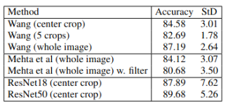

## Requirements

- pytorch 1.12.1
- torchvision 0.13.1
- opencv 4.6.0
- pillow 9.2.0

The complete environment can be found in the file conda_env.txt

## Generate annotations

This code assumes that a symbolic link named "data_dlc" is present in the working folder. This is linked to the DLC2021 original dataset folder.

Run the following script to generate an annots.json file with the required fields for the feature extractions process:

<pre><code>
python create_annots.py
</code></pre>

This file contains, for each image:
- The path relative to the DLC2021 folder
- The label (0 for original, 1 for recaptured)
- The bounding box of the document in the image, extracted from the annotations provided by the original DLC2021

## Feature extraction

#### Wang with center crop

<pre><code>
python wang.py center
</code></pre>

#### Wang with whole document image

<pre><code>
python wang.py standard
</code></pre>

#### Wang with 5 crops for each image

<pre><code>
python wang.py multiple
</code></pre>

#### Mehta et al without filter:

<pre><code>
python mehta.py
</code></pre>

#### Mehta et al with filter:

<pre><code>
python mehta.py filter
</code></pre>

#### Features from ResNet18:

<pre><code>
python resnet.py 18
</code></pre>

#### Features from ResNet18:

<pre><code>
python resnet.py 50
</code></pre>

Note that all these processes will take some time (up to 5 hours each). You can also directly download all the features from [here](https://drive.google.com/file/d1zqDfiMaNp6oS3Dn8fFHM_0T3cSs07h2B/view?usp=sharing).

## Feature evaluation

All the features are evaluated by a LinearSVM from sklearn. The specific hyperparameters, valid for all the results we reported, are:

- Max number of iterations: 10e5
- Confidence threshold: 1e-3
- Number of cross validation splits: 10

To perform evaluation, run the following split with the path to the feature json (generated in the previous steps) as argument, for example:

<pre><code>
python eval_feats.py wang.json
</code></pre>

Note that all the features are normalized before being used to train the SVM.

## Results

